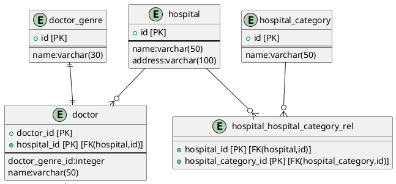

# java-learning

## JPQL

SQL：execute query for real database
JPQL：execute query for entities maintained by entityManager

## sample table definitions

```puml
@startuml

entity "hospital" {
    + id [PK]
    ==
    name:varchar(50)
    address:varchar(100)
}

entity "doctor_genre" {
    + id [PK]
    ==
    name:varchar(30)
}

entity "doctor" {
    + doctor_id [PK]
    + hospital_id [PK] [FK(hospital,id)]
    ==
    doctor_genre_id:integer
    name:varchar(50)
}

doctor_genre||--||doctor
hospital --o{ doctor


entity "hospital_category" {
    + id [PK]
    ==
    name:varchar(50)
}

entity "hospital_hospital_category_rel" {
    + hospital_id [PK] [FK(hospital,id)]
    + hospital_category_id [PK] [FK(hospital_category,id)]
}

hospital --o{ hospital_hospital_category_rel
hospital_category --o{ hospital_hospital_category_rel

@enduml
```
